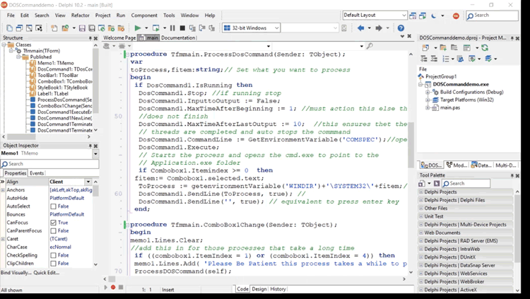

**Execute CMD command-line programs with Delphi and DOSCommand.**

**Background**

When requiring a command –line program in your Application, setting up
‘createprocess ‘ and pipes is not that difficult. But it would be important to
multithread your code so that your application is not stalled while your
command-line application is running.

Save yourself the trouble as it is easier to use ‘DosCommand’. Straight out, it
is not a simple to use component as it looks?

**Free Component**

The TurboPack DOSCommand [Component Information in
Github](https://github.com/TurboPack/DosCommand) indicates the following:-

This Component lets you execute a Dos program (exe, com or batch) and catch the
output in order to put it in a memo. It states that the result should come back
line by line.

You can download the Component from Github or through the GETIT Manager.

Limited examples can be found in the source Header and are a little outdated and
lacking explanation.

**Example App**

Here is an Example App set up with code that calls various exe(s) such as
ipconfig etc. The code is available to download.

**The Component**

On reflection, the Component has been well written largely for Win32 and
recently converted to Unicode and includes 64bit for VCL and FMX.

**DosCommand** is a multithreaded application comprising the following Classes:-

**TProcessTimer** - to stop the process after XXX seconds and cannot be accessed
externally.

**TInputLines** - used to synchronise the ‘inputlines’ from main thread with
‘TDosThread’.

**TSyncString** - synchronises ‘TReadPipe’ and ‘TDosThread’.

**TReadPipe** - awaits for the pipe input then writes the pipe input to the
‘Tsynchstring ‘the event is then set and ’TDosthread’ then reads the input.

**TDosthread -** This thread awaits outputs through the pipe.

**TDosCommand** - forms the component which has the following.

*public calls*:-

*Create;*

*Destroy;*

*Execute;* // the user call this to execute the command

*SendLine*// add a line in the input pipe

*Stop;* // the user can stop the process with this method, stops process and
waits

*EndStatus*; (esStop, // stopped via ‘TDoscommand.Stop’

esProcess, // ended via Child-Process

esStill_Active, // still active

esNone, // not executed yet

esError, // ended via Exception

esTime); // ended because of time

*ExitCode;*

*IsRunning;* // When true, a command is still running

*Lines;* // if the user want to access all the outputs of a process, lines are
deleted before execution

*OutputLines;* // can be lines of a memo.

*Priority;* // stops process and waits, only for ‘createprocess’

*ProcessInformation;* // ‘Processinformation’ from ‘createprocess’

*CommandLine;* // command to execute

*CurrentDir;* // ‘currentdir’ for’childproces’s. if empty then ‘currentdir’ is
same as parent ‘currentdir’.

*Environment;* // add Environment variables to process .if empty then
environment of parent process is used)

**InputToOutput:** // check it if you want that the inputs appear also in the
outputs

*MaxTimeAfterBeginning;*

*MaxTimeAfterLastOutput;*

*OnCharDecoding;*

*OnCharEncoding;* // Events to convert ‘buf’ to ‘Unicodestring’ and reverse !!
not needed if console of child uses AnsiString!! This event is not threadsafe
and no need to change during execution

*OnExecuteError;* // event if ‘DosCommand.execute’ is aborted via Exception

*OnNewChar;* // event for each New char that is received through the pipe

*OnNewLine;* // event for each New line that is received through the pipe

*OnTerminated;* // event for the ‘endofprocess’, normally, time out or by
‘DosCommand.Stop’ action.

*OnTerminateProcess;* // event to ask for ‘processtermination’.

**What functions don’t Work**

I could not get results from the following functions:- ‘Lines’, ‘Outputlines’
and ‘Environment(strings)’ as it resulted in error outputs.

**Extra Functions**

Working with char decoding/encoding with on ‘newchar’ allows you to work with
individual chars to process. I did not find the need to work with these
functions unless extracting individual char outputs.

**Making DosCommand Work**

The easiest is to drop the DOScommand component, button and a memo on your form.

Start the code to check if DOScommand is running in the background. This will
ensure that if you happen to rerun the process will not send error messages.

if DosCommand1.IsRunning then

DosCommand1.Stop;

The source states that the timer will stop the process at the
‘maxtimeafterbeginning’ set time. However setting the default = 0 results in the
process not starting or ending.

The source code ‘TThreadtimer’ requires a value \> 0 to process. I found that
with slower win32 cpu’s that ‘maxtimeafterOutput = 30’ was the best fit for
mixing 32bit and 64bit. Add the following code.

DosCommand1.InputtoOutput := false;

DosCommand1.MaxTimeAfterBeginning := 1;

DosCommand1.MaxTimeAfterLastOutput := 30;// Value = 1 for a fast win64 multicore
processor

(\* you can type the directory directly\*)

DosCommand1.CommandLine := GetEnvironmentVariable('COMSPEC'); // opens the
CMD.exe

Execute the code to open the CMD.exe in the applications folderpath.

DosCommand1.Execute;

Further processes are made with sendline……

The Boolean portion of Sendline works as follows:-

-   *True* creates a ‘ ’ (space) before the string.

-   *false* creates a \_ (Lowercasespace) before the string.

DosCommand1.SendLine(‘C:\\Windows\\System32\\ ipconfig’, true); // will open the
ipconfig.exe

DosCommand1.SendLine('', true); // equivalent to pressing the enter key

To capture the processes to a memo use ‘dosCommandNewline’ procedure as
follows:-

procedure TForm4.DosCommand1NewLine(ASender: TObject; const ANewLine: string;

AOutputType: TOutputType);

begin

AOutputType:=otEntireLine;

memo1.Lines.Add(ANewline); //Outputs the lines of the CMD.EXE

end;

To process after the exe has completed, use ‘dosCommandTerminated’ procedure.
This ‘onterminate’ function is the only way to know if the multithreaded process
has stopped running. This is handy if CMD is running a long running exe. The app
waits till the end before processing more messages. No need to call
‘Application.processmessages’.

procedure TForm4.DosCommand1Terminated(Sender: TObject);

begin

//use this area to do something when the multithreaded process has
completed/terminated

memo1.Lines.Add('Completed The Process...........');

end;

That should get you up and running.

**Bayesean Blog** www.bayeseanblog.com

Happy Coding
